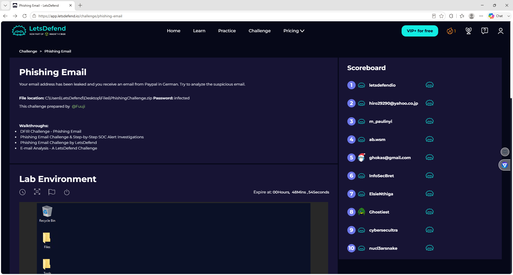
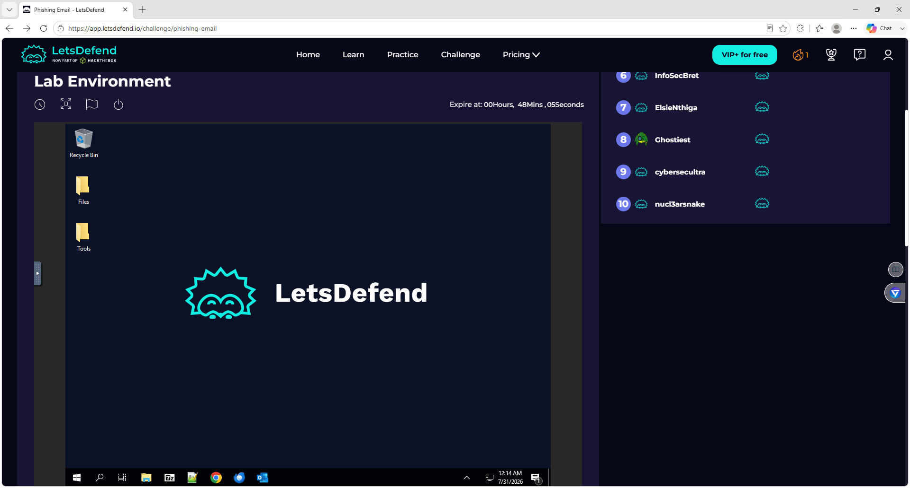
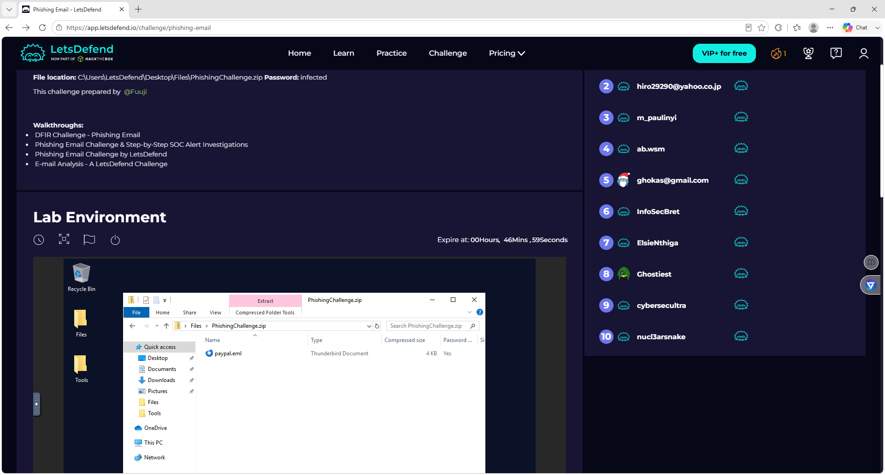
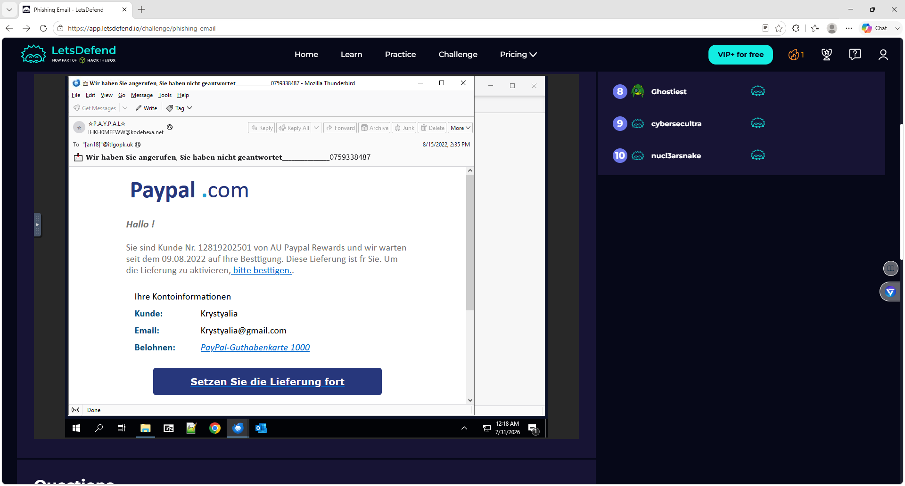
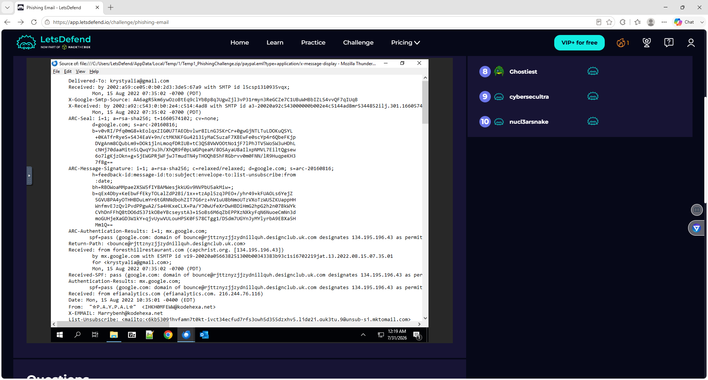
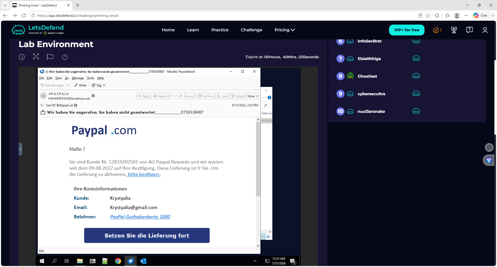

# Darwin-LetsDefend-Phishing-Email-Investigation

## Project Overview

This project documents a phishing email investigation performed in the LetsDefend platform. The investigation focused on analyzing a PayPal-themed phishing email by examining the email contents, sender information, message headers, and phishing indicators to determine whether the email was malicious.

---

## Objectives

- Investigate a suspicious phishing email
- Analyze email headers
- Identify phishing indicators
- Examine sender information
- Detect social engineering techniques
- Document investigation findings

---

## Lab Environment

| Platform | LetsDefend |
|----------|------------|
| Category | Phishing Email Analysis |
| Difficulty | Beginner |
| Investigation Type | Email Security |

---

## Tools Used

- LetsDefend
- Mozilla Thunderbird
- Email Header Analysis
- SMTP Header Inspection
- Manual IOC Analysis

---

## Investigation Process

### 1. Challenge Overview

Reviewed the phishing email investigation objectives and prepared the analysis environment.

### 2. Lab Environment

Accessed the LetsDefend virtual machine and prepared the phishing investigation workspace.

### 3. Open the Phishing Email

Opened the suspicious email inside Mozilla Thunderbird and examined the message.

### 4. Analyze the Email

Reviewed the phishing email content, branding, sender information, and social engineering techniques.

### 5. Inspect Email Headers

Reviewed the raw email headers to identify sender infrastructure, SPF authentication, Return-Path information, and routing details.

### 6. Document Findings

Collected evidence and documented phishing indicators throughout the investigation.

---

# Phishing Indicators Identified

- Fake PayPal branding
- Suspicious sender address
- Social engineering tactics
- Urgency to take action
- HTML phishing email
- Suspicious sender infrastructure
- Email header anomalies

---

# Skills Demonstrated

- Email Security Analysis
- Phishing Investigation
- Email Header Analysis
- Threat Hunting
- IOC Identification
- Social Engineering Detection
- SOC Investigation Workflow
- Security Documentation

---

# Screenshots

## 01 - Challenge Overview

---

## 02 - Lab Environment

---

## 03 - Phishing Email ZIP Archive Opened

---

## 04 - PayPal Phishing Email Opened

---

## 05 - Email Headers Analysis

---

## 06 - Phishing Email Content

---

## 07 - Phishing Email Context Menu

---

# Key Findings

- Successfully identified a PayPal-themed phishing email.
- Examined sender information and email headers.
- Identified multiple phishing indicators and social engineering techniques.
- Documented evidence following a SOC analyst investigation workflow.

---

# MITRE ATT&CK

- **T1566.001** – Phishing: Spearphishing Attachment
- **T1566.002** – Phishing: Spearphishing Link

---

# Lessons Learned

This investigation demonstrated the importance of validating sender information, analyzing email headers, recognizing phishing techniques, and documenting findings before interacting with suspicious emails.

---

## Author

**Darwin Brown Jr.**

Cybersecurity Portfolio
